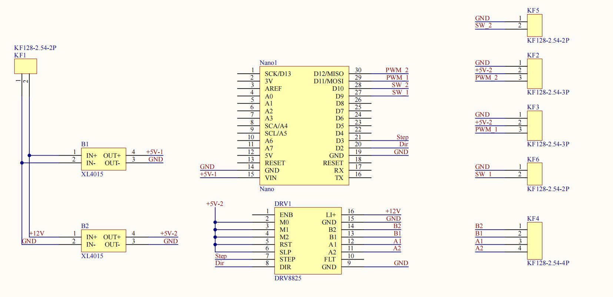
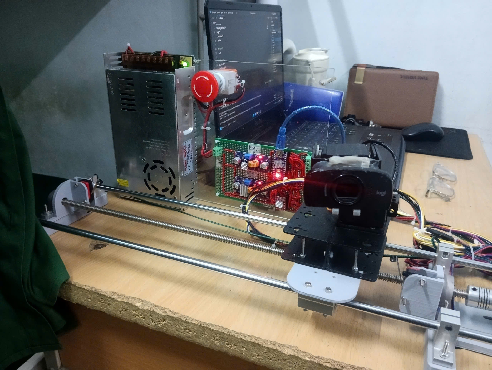
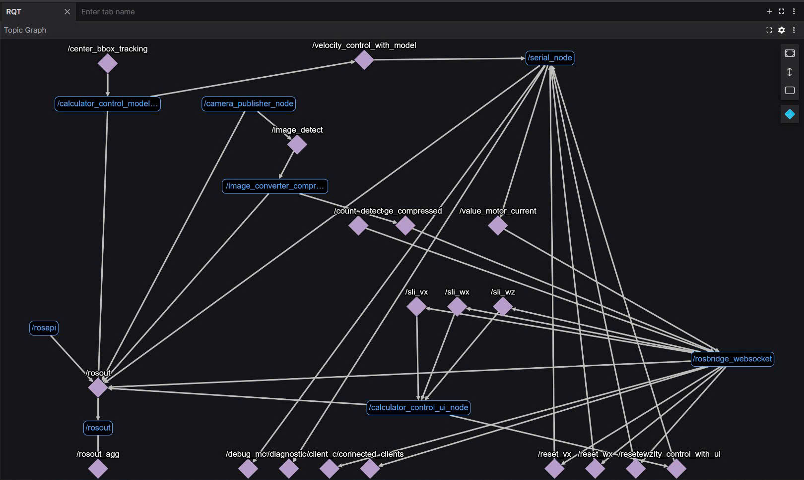

# Mã nguồn thiết kế hệ thống Robot theo dõi Drone
### Các hình ảnh cụ thể

### Nội dung
1. Sử dụng mô hình YOLOV5 kết hợp thuật toán SORT để bám bắt Drone
2. Sử dụng nền tảng ROS Noetic để triển khai hệ thống kết hợp với rosbridge - kết nối với UI  và rosserial - kết nối với Adruino Nano điều khiển hệ thống Robot

### Liên kết
1. [MCAD_ECAD_MODEL](https://gitlab.com/phn1712002/System_Tracking_Drone)

## Liên hệ
1. Tác giả : Phạm Hoàng Nam
3. Gmail : phn1712002@gmail.com 
